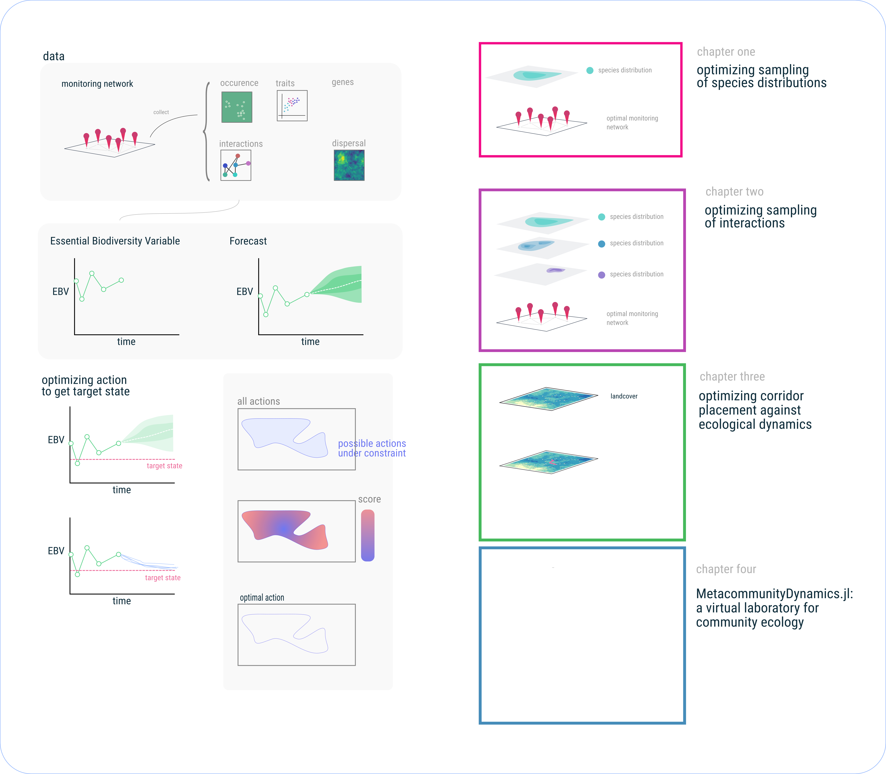
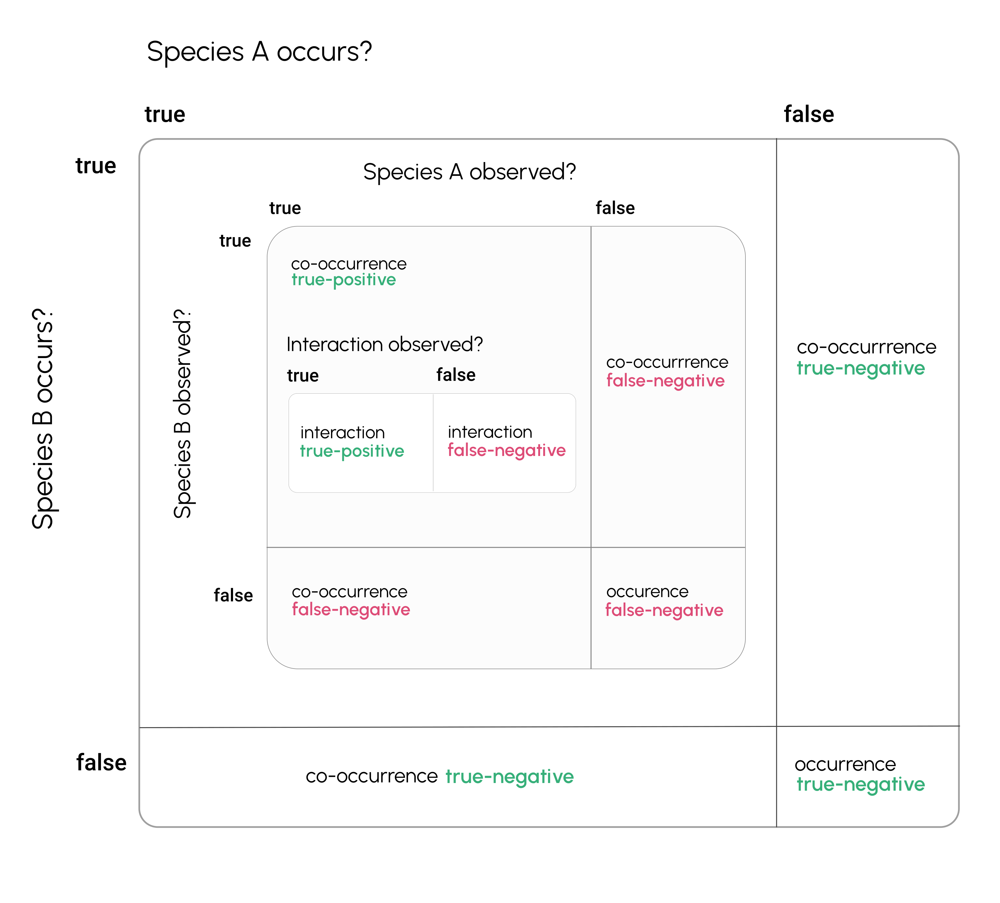
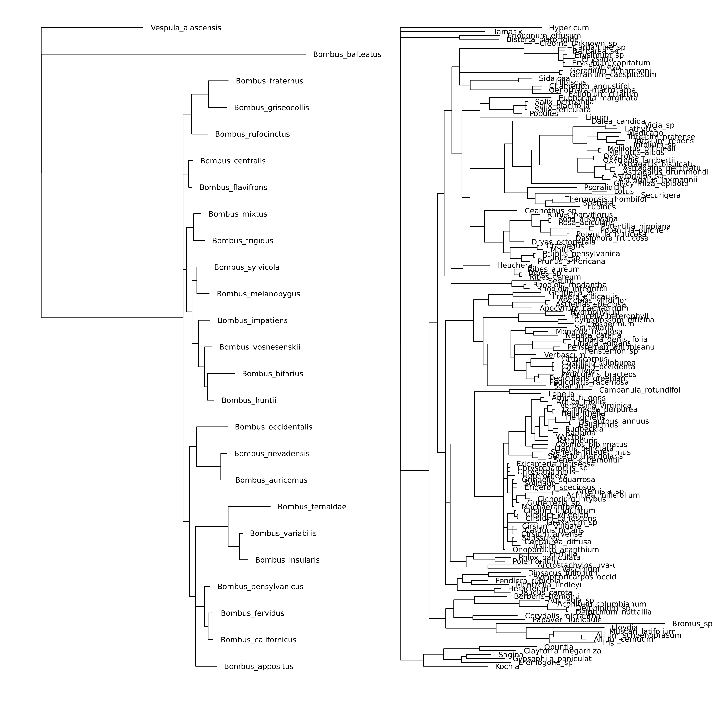

# Introduction

**P1**

Within the last several hundred years, human activity has rapidly
changed Earth's atmosphere, oceans, and surface. Greenhouse gas
emissions have caused an increase the temperature of both Earth's
terrestial surface and its oceans, and both agricultural and urban
development has rapidly reshaped the cover of Earth's surface. These
the bulk of this change has occurred within the last several hundred
years, a geological instant, potentially inducing shocks to ecosystems
that could threated their integrity [@Scheffer]. As a result
understanding and predicting how ecosystems will change in the future,
_ecological forecasting_, and making making descisions based on these
predictions mitigating the consequences of this change, on ecosystems
has emerged as an imperative for ecology and environmental science
[@Dietze2017PreEco;].

**P2**

However, robust forecasting of ecological processes will change in the
future is, to say the least, quite difficult [@Beckage2011LimPre;
@Petchey2015EcoFor]. This difficultly is compounded by a few factors,
the first being that sampling ecosystems is not easy. Ecological data
is often biased, and noisey, spatially and temporally sparse.  As a
result _ecosystem monitoring_ [@Makiola2020KeyQue] has emerged as an
imperative. Developing a system for ecological observation, which is
able to coordinate across locations. [@AndyUrbanBiomonitoring paper].

The second major challenge in forecasting ecosystems is that the
underlying dynamics of most ecological processes are fundementally
unknown (and unknowable) and instead must be inferred.

Much of the history of quantitatively modeling ecosystems have been
done in the language of dynamical systems, describing how the value of
an observable state of the system, represented by a vector of numbers
$[x_1, x_2, \dots, x_n]^T = \vec{x}$ changes as over time. It turns
out to be much more effective to, rather than attempt to directly
model $\vec{x}(t)$ itself, to instead describe how $\vec{x}$ changes
from one timestep to the next, yielding models in the form of
differential equations in continuous-time settings--$\frac{dx}{dt} =
f(x)$-- or difference equations in discrete-time settings--$x_t =
f(x_{t-1})$--where $f:\mathbb{R}^n \to \mathbb{R}^n$ is an arbitrary
function describing how the system changes on a moment-to-moment basis
(e.g. in the context of communities, $f$ could be Lotka-Voltera,
Holling-Type-III or DeAngelis-Beddington functional response).  The
form of this functional response in real systems is effectively
unknown, and some forms are inherently more "forecastable" than others
[@Chen2019RevCom].

**P3**

However, we run into many problems when aiming to apply this type of
model to empirical data in ecology.

The initial success of ODE models can be traced back to the larger
program of ontological reductionism, which became the de facto
apporoach model physical sciences after its early success in physics,
which, and by the time ecology was becoming a quantitative science
(sometime in the 20th century, depending on who you ask), became the
foundation for early quantitative models in ecology.

But ecosystems are perhaps the quintessential example of system that
cannot be understood simply by iterative reduction of its components.
Emergent phenomena, mechanisms at different scales, etc.

Some have been explored in the ecological literature: (1) Some
applications of dynamic models in ecology assume long-run equilibrium.
(2) Stochasticity

(3) Ecological processes vary across more variables than the tools of
analytic models are suited for. As the number of variables in an
analytic model increases, so does the ability of the scientist to
decern clear relationships between them, and so does overfitting
potential. Curse of dimensionality--- Until the 20th century, no
theory of the gravitational dynamics of more than 2 bodies.
Understanding the gravitational dynamics of more than two planets with
any reliability proved difficult. Using the same models (diffeqs), how
could we adequately predict ecosystems?

**P4**

The term _ecological forecasting_ implicitly creates an analogy
between predicting how ecosystems will change in the future by using
the term "forecasting"---the most immediate analog being the success
story of weather forecasting via numerical weather prediction (NWP).

Although it is become almost hack to complain about the dang weather
forecast being wrong, over the least 50 years the [@Bauer2015QuiRev].

The success of NWP, and the Earth observations that support it should
serve as a template for development of a system for monitoring Earth's
biodiversity. Much like ecology, NWP is faced with high-dimensional
systems that are governed by different mechanisms at different scales.

NWP has worked because it incorporates information about data and
meteorological processes collected at difference scales into models
that. Use of computational methods in NWP.

Much as one would not aim to forecast the weather in Quebec by
applying Navier-Stokes, forecasting ecological systems must

Transition to simulation as the solution: shift toward approach of
building models that _generate_ data.

(resolving the semantic ambuity of what differentiates "mechanistic"
vs "phenomological" models is out of scope for now).

More broadly a reflection reflect ecology lagging behind the
statistical methods used in sciences that face similar challenges
(many dimensions, many mechanisms at different scales, each with
stochasticity). Chaotic dynamics emerge from simple analytic models,
and . Whether ecosystems actually exhibit chaotic behavior is a
different question.

**P5**

But forecasting isn't the only difficult problem here.

Transition to theme of optimization given unknown information. A
forecast gives us a range of future values with uncertainty around
them. Further a convenient property that a forecasting model's
uncertainty goes up over time (if we assume the underlying process is
Markov--this is a strong assumption but oft true of the models we fit
to temporal data)

In face of uncertainty, decision making is an optimization problem. We
have some goal state for the future, and some estimate of what the
state of the world will be given a set of actions. Frame optimization
problem mathematically an introduce concept of solution-space and
constraint.

Indeed Marx's most well known quote that "philosophers have hitherto
only interpreted the world in various ways; the point is to change
it". and a necessary step toward establishing a just and sustainable
world.

{#fig:thesis}

**P6 -- final intro para**

Three major components here: 1) Ecosystem monitoring, 2) Forecasting
using the  products of that monitoring, and 3) Choosing the best
possible mitigation  strategy.

This flow is outlined in the left panel of @fig:thesis

# Chapter One: Forecasting the spatial uncoupling of a plant-pollinator network

Plants and pollinators form interaction networks, called the
"architecture of biodiversity" [@Jordano2007].

The stability, function, and persistance of ecosystems relies on the
structure of these interactions. Antropogenic change threatens to
unravel these networks. Two aspects to this change: spatial and
temporal.  Spatially, range shifts along elevational gradient, and
temporall, phenological shifts.

The issue is that we don't really know what interactions are like now.
So not only do we need to predict with data that is spatially and
temporally sparse and likely to contain many interaction
"false-negatives" [@Strydom2021]

This chapter uses several years of data on bee-flower phenology and
interactions, combined with spatial records of species occurrence via
GBIF, to forecast how much overlap there will be between
plants/pollinators in space/time.

In stages, (1) take data from multiple sites to predict a spatial
metaweb of _Bombus_-flower interactions across Colorado. (2) Predict
how these spatial distributions will change under CMIP6. and (3)
quantify the lack of overlap between species for which there is a
predicted

**CH1 concept figure**

## Data

The data for this chapter is derived from multiple souces and can be 
split into three categories. (1) Field data from three different 
locations acvross Colorado. All field sites have multiple plots
across an elevational gradient. 

System description: lots of data on _Bombus_ (bumblebees) and
wildflowers. Three different sites, (7/7/3) years each, each covering
an elevational gradient.

## Methods

Split the process into parts.

1) Building an interaction prediction model. 2) Make it spatial based
on distributions. 3) Forecast distributions based on CMIP6.

## Preliminary Results

1) we got a tree

Transition to next chapter by discussing uncertainty in interaction
prediction across space.

# Chapter Two: Optimizing spatial sampling of species interactions

There are false-negatives in interation data. Co-occurrence is not the
same thing as interaction [@cite], but often is  used as a proxy.

This chapter unravels the relationship between a given species
relative abundance and the sampling effort needed to adequately
understand this species distribution and interactions.

There is more than one way to observe a false-negative.

## Methods

- the missing link paper, turn this into optimizing with two different
  SDMs relative abundance and its effect on false negative
  non-independent associations in samples

- simulate species distribution and efficacy of detection given a set
  of observation points where the dist from observation site decays.
  optimize set of repeated sampling locations L for a _known_
  distribution D. address SDM not being the territory

## Results

- nonrandom association figure sampling effort under neutral model

### In-progress results

# CH3 optimizing corridor placement

This chapter proposes an algorithm for optimizing restoration across
space

(corridorplacement/restoration effort) given a raster where each cell
indicates land-cover. The optimization method uses the result of a
simulated process (specifically occupancy dynamics in the landscape)
and uses simulated annealing to estimate the global optimum of the
targetstate (specfically mean-time-to-extinction for the occupancy
dynamics example).

## Methods

- land cover -> resistance -> extinction time simulated annealing to
- optimize landscape optimization

# CH4 a software note on the resulting packages.

(MetacommunityDynamics.jl: a virtual laboratory for community
ecology): a collection of modules in the Julia language for different
aspects of metacommunity ecology, including most of the code used for
the preceding chapters.

- TK conceptual figure with interfaces between what I'm writing / have
- contributed to and linked with other libraries

- `Observatories.jl`, `Corridors.jl`, `MCD.jl`

# Conclusion

# Appendix

# References
