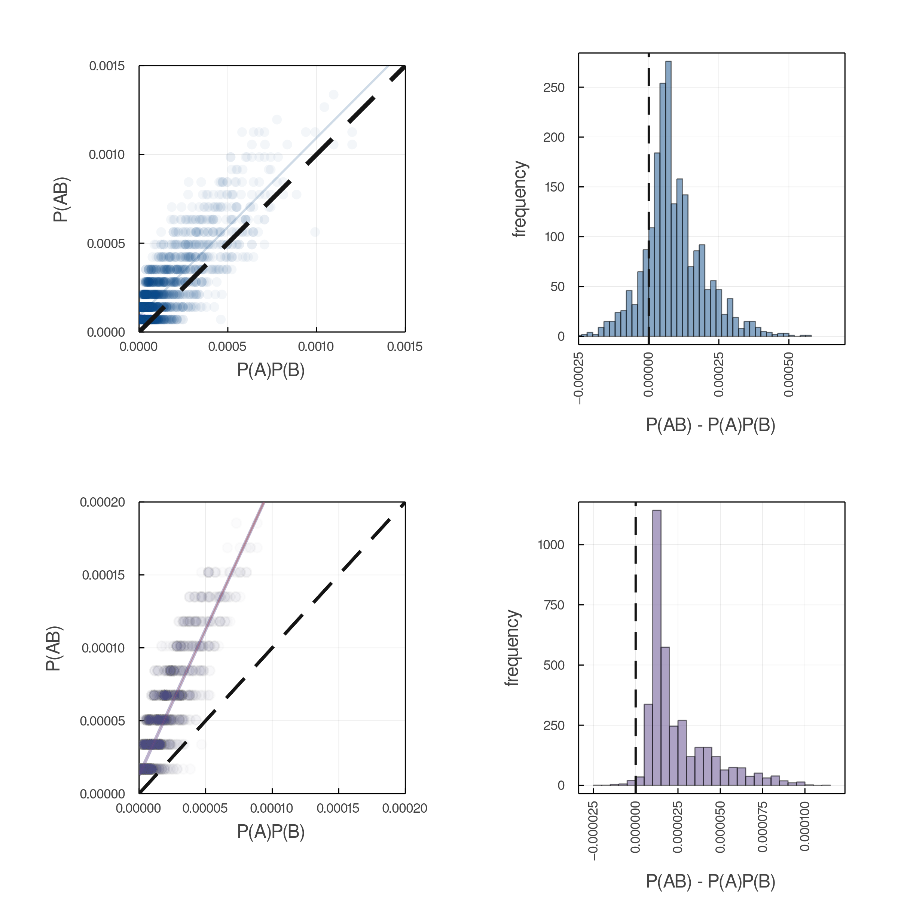
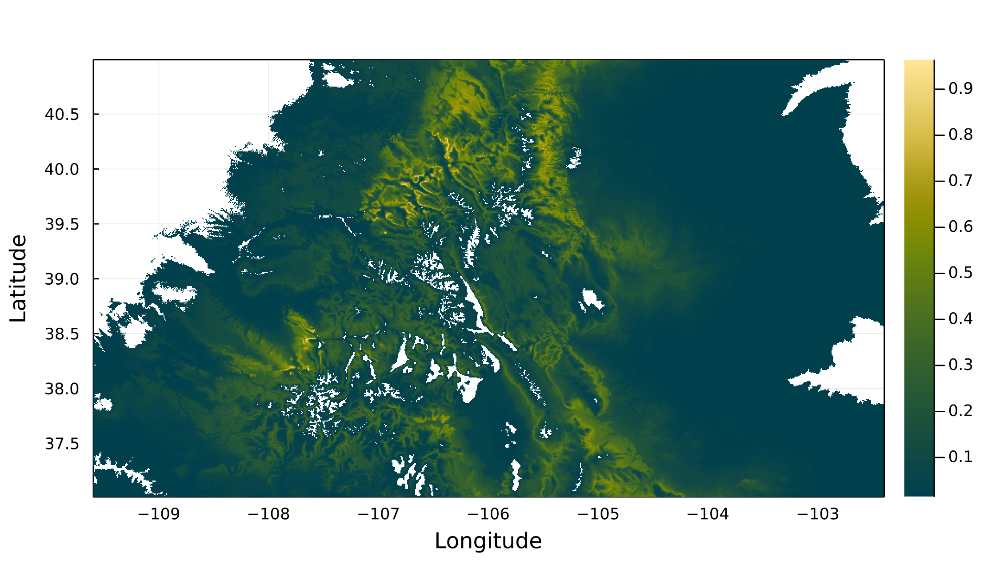
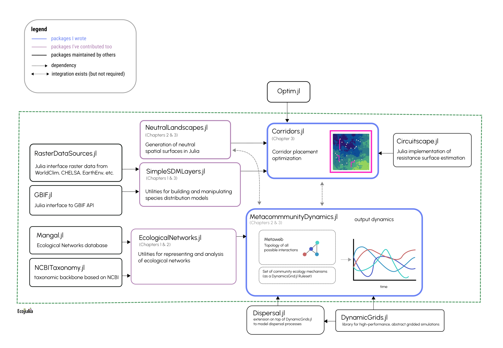

# Introduction

Within the last several hundred years, human activity has induced
rapid changes in Earth's atmosphere, oceans, and surface. Greenhouse
gas emissions have caused an increase the temperature of both Earth's
terrain and oceans, and both agricultural and urban development has
rapidly reshaped the Earth's land cover. These the bulk of this change
has occurred within the last several hundred years, a geological
instant, inducing a sudden shift in conditions to Earth's climate and
biosphere. As a result _ecological forecasting_---TK DEFINITION ---and
then using these forecasts to make decisions to mitigate the negative
consequences of this change on ecosystems, their functioning, and the
services they provide to humans has emerged as an imperative for
ecology and environmental science [@Dietze2017PreEco]. However, robust
prediction of ecological processes is, to say the least, quite
difficult [@Beckage2011LimPre; @Petchey2015EcoFor]. This difficultly
is compounded by a few factors, the first being that sampling
ecosystems is not easy. Ecological data is often biased, noisey, and
sparse in both space and time. The current paucity of ecological data
has resulted in much interest in developing global systems for
_ecosystem monitoring_ [@Makiola2020KeyQue], which would systematize
the collection of biodiversity data in manner that makes detecting and
predicting change more possible than at the moment [@Urban2021CodLif].

***TK add mention of interaction prediction here as they effect dynamics***
The second major challenge in ecological forecasting is that the
underlying dynamics of most ecological processes are unknown and
instead must be inferred from this (sparse) data. Much of the history
of quantitatively modeling ecosystems have been done in the language
of dynamical systems, describing how the value of an observable state
of the system, represented by a vector of numbers $[x_1, x_2, \dots,
x_n]^T = \vec{x}$ changes as over time, yielding models in the form of
differential equations in continuous-time settings, $\frac{dx}{dt} =
f(x)$, or difference equations in discrete-time settings, $x_t =
f(x_{t-1})$, where $f:\mathbb{R}^n \to \mathbb{R}^n$ is an arbitrary
function describing how the system changes on a moment-to-moment basis
(e.g. in the context of communities, $f$ could be Lotka-Voltera,
Holling-Type-III or DeAngelis-Beddington functional response). The
form of this functional response in real systems is effectively
unknown, and some forms are inherently more "forecastable" than others
[@Chen2019RevCom; @Pennekamp2019IntPre; @Beckage2011LimPre]. The
initial success of these forms of models can be traced back to the
larger program of ontological reductionism, which became the default
approach to modeling in the sciences after its early success in
physics, which, by the time ecology was becoming a quantitative
science (sometime in the 20th century, depending on who you ask),
became the foundation for mathematical models in ecology.

However, we run into many problems when aiming to apply this type of
model to empirical ecological data. Ecosystems are perhaps the
quintessential example of system that cannot be understood by
iterative reduction of its components into constituent
parts---ecological phenomena are emergent: the product of different
mechanisms operating a different spatial, temporal, and organizational
scales [@Levin1992ProPat].  Further this analytical approach to
modeling explicitly ignores known realities: ecological dynamics not
deterministic and many analytic models in ecology assume long-run
equilibrium. Finally, perhaps the biggest challenge in using these
models to describe ecological processes is ecosystems consist of more
dimensions than the tools of analytic models are suited for. As the
number of variables in an analytic model increases, so does the
ability of the scientist to discern clear relationships between them
given a fixed amount of data, the so-called "curse" of dimensionality.

But these problems are not solely unique to ecology. The term
_ecological forecasting_ implicitly creates an analogy with weather
forecasting. Although it has become a trite joke to complain about the
weather forecast being wrong, over the least 50 years the field of
numerical weather prediction (NWP) has dramatically improved out
ability to predict weather across the board [@Bauer2015QuiRev]. The
success of NWP, and the Earth observations systems that support it
[@Hill2004ArcEar], should serve as a template for development of a
system for monitoring Earth's biodiversity. Much like ecology, NWP is
faced with high-dimensional systems that are governed by different
mechanisms at different scales. The success of NWP is that, rather
than, say, attempt to forecast the weather in Quebec by applying
Navier-Stokes to entire province, to instead use simulation models
which describe known mechanisms at different scales, and use the
availability to increasing computational power to directly simulate
many batches of dynamics which directly incorporate stochasticity and
uncertainty in parameter estimates via random number generation.

But forecasting is only half the story---if indeed "[ecologists] have
hitherto only interpreted the world in various ways; the point is to
change it", then once we have a forecast about how an ecosystem will
change in the future, what if this forecast predicts a critical
ecosystem service will deteriorate? We are still left with the
question, what do we in the time being to mitigate the potentially
negative consequences a forecast predicts? In this framing, mitigating
the consequences of anthropogenic change on ecosystems becomes an
optimization problem: given a forecast of the future state of the
system, and some "goal" state for the future, the problem is then to
optimize our intervention into the system to maximize the probability
the system approaches our "goal" state. This dissertation aims to this
framework for ecosystem monitoring and forecasting (@fig:thesis,
left), and each chapter address some aspect of this pipeline to data
from a monitoring network to forecasts to mitigation strategy
(@fig:thesis, right).

{#fig:thesis}

The primary research challenges this thesis addresses: how do we
design ecological samples to? How do we build the software
infrastructure to assimilate data from a variety of sources? How do we
propagate uncertainty from data to forecasts? The flow of chapters
follows the flow in @fig:thesis (left), from data collection via a
monitoring network, to forecasting an essential biodiversity variable
(EBV), to optimizing mitigation strategy based on constraints. In
chapter one, we discuss how simulation can aid in the design of
ecological samples and monitoring network design. In chapter two we
use data to forecast the uncoupling of a plant-pollinator network. In
chapter three, we apply simulation methods in landscape ecology to
optimize corridor placement with respect maximize the
time-until-extinction of a metapopulation. The fourth and final
chapter is the software (_MetacommunityDynamics.jl_) which enables the
rest of the dissertation.

# Chapter One: Optimizing spatial sampling of species interactions

## Objective

This chapter uses simulation models to investigate the relationship
between species relative abundance, sampling effort, and probability
of observing an interaction between species in order to aid in the
design of samples of ecological interactions, and to provide a null
expectation of false-negative probability for a dataset of a given
size. Further it then proposes a method for optimizing the spatial
sampling locations to maximize the probability of detecting an
interaction between two species given a fixed number of total of
observations, and the distributions of each species. This addresses
the optimization of monitoring network part of the flow from data to
mitigation at the top of @fig:thesis, left. As explored in the
previous chapter, there are false-negatives in interaction data.
However, there is more than one way to observe a false-negative when
sampling interactions. @fig:fnrtaxonomy shows a taxonomy of
false-negatives in occurrence, co-occurrence, and interaction data.

{#fig:fnrtaxonomy}

## Methods

The first result is to compute a null expectation of the probability
of an interaction false-negative as a function number of total
observations of individuals of _any species_. This is done by
simulating the process of observation, where the probability of
observing a given species is its relative abundance. We use a
log-normal distribution of relative abundance [@Hubbell2001UniNeu] and
simulating the process of observation on food-webs generated using the
niche model [@Williams2000SimRul] with connectance parameterized by
the flexible-links model [@MacDonald2020RevLin]. An example of this
relation for networks with varying spceies richness is shown in
@fig:fnr.

We then go on to testing some assumptions of this neutral model with
empirical data. Primarily that we analytically show that our neutral
model, if anything, underestimates the probability of false-negatives
if there are positive associations between species co-occurrence, and
we show these positive associations exist in two sets of spatially
replicated samples of interaction networks [@Hadfield2014TalTwo;
@Thompson2000ResSol; @fig:posassoc]---further I'm planning to add the
field data from the previous chapter into this analysis once
available.

Finally this chapter proposes a simulated annealing method to optimize
the a set of $n$ points in space to maximize the probability of detecting
an interaction between two species $a$ and $b$ with _known_ distributions $D_a$, $D_b$.

## Results

The first major result is using the simulation of the observation
process described above to generate expectations of interaction
false-negative rate (FNR) as a function of total number of
observations, with the goal being for this estimate to be used as
correction for detection  error when fitting an interaction prediction
model. This relationship varies with the total richness of the
metaweb [@fig:fnr].

{#fig:fnr}

The second major result is that we analytically show that the this
simulated observation model, by assuming that there is no correlation
between observing two species given that they interaction, actually
underpredicts the realized false-negative interaction rate. We then
demonstrate that this association exists in two empirical systems
[@fig:posassoc].  

{#fig:posassoc}

## Progress

This chapter is mostly complete. The only remaining work is the
implementation of simulated annealing optimization process. This will
be done by using a proposal function which takes a set of coordinates
in space and proposes a new location for each point based on a
distance-decaying kernel.

# Chapter Two: Forecasting the spatial uncoupling of a plant-pollinator network

Interactions between plants and pollinators form networks which
together structure the "architecture of biodiversity"
[@Bascompte2007PlaMut]. The functioning and stability of ecosystems
emerge from these interactions, but anthropogenic change threatens to
unravel and "rewire" these interaction networks
[@CaraDonna2017IntRew], jeopardizing the persistence of these systems.
Plant-pollinator networks face two possible forms of rewiring in
response to anthropogenic environmental change: spatial and temporal.
Range shifts could cause interacting species to no longer overlap in
space, and shifts in phenology could cause interacting species to no
longer occur at the same time of year. This chapter uses several years
of data on bumblebee-flower phenology and interactions across several
field sites, each consisting of several plots across an elevational
gradient, combined with spatial records of species occurrence via GBIF
to forecast the uncoupling of the plant-pollinator metaweb of
Colorado.

## Methods

The data for this chapter is derived from multiple sources that can be
split into four categories. (1) Field data from three different field
sites across Colorado, each with multiple plots across an elevational
gradient, for seven, seven, and three years respectively. This data
was collected by Paul CaraDonna and Jane Oglevie (from the Rocky
Mountain Biological Laboratory; RMBL) and Julian Resasco (CU Boulder).
(2) GBIF spatial occurrence records of each of these species across
Colorado, including a metaweb of interactions across all of Colorado
taken from GBIF. (3) Remotely sensed data consisting of current and
forecasting bioclimatic variables from CHELSA. (4) Phylogenies for
both bee and flower species derived from NCBI GenBank barcodes for
mitochondrial COI (bumblebees) and chloroplast rbcL (flowers).

As the data we have is spatially sparse and likely to contain many
interaction "false-negatives" [@Strydom2021RoaPre], we begin by
predicting a metaweb of interactions across Colorado as they exist _in
the present_. We do this using a set of candidate interaction
prediction models: relative abundance only, phylogenetic embedding
only (a la @Strydom2021FooWeb), niche embedding only
[@Gravel2019BriElt], and all pairwise combinations of those
constituent models. After validating and selecting the best performing
model, we then predict how these distributions of each of these
species will change under the CMIP6 consensus climate forecast
[@Karger2017CliHig], and then finally quantify the reduction in
spatial between species for which there is a predicted interaction.

## Results

Here we show the in-progress results, which are the prerequisites for the
analysis outlined above: phylogenies for both plant and bee species
(@fig:phylo) and species distribution models for all species (an
example shown in @fig:example_sdm).

{#fig:phylo}

{#fig:example_sdm}

## Progress

At the moment, we have derived phylogenies and SDMs for all the
species present in the Colorado GBIF metaweb. I've also been exploring
the data available from Julian Resasco. The primary constraint on
further progress is that we are waiting on the finalization of a data
sharing agreement with RMBL.

# Chapter Three: Optimizing corridor placement against ecological dynamics

## Objective

As land-use change has caused many habitats to become fragmented and
patchy, promoting landscape connectivity has become of significant
interest to mitigate the effects of this change on Earth's
biodiversity. However, the practical realities of conservation mean
that there is a limitation on how much we can modify landscapes in
order to do this. So what is the best place to put a corridor given a
constraint on how much surface-area you can change in a landscape?
This is the question this chapter seeks to answer. Models for
inferring corridor locations have been developed, but are limited in
that are not developed around promoting some element of ecosystem
function, but instead by trying to find the path of least resistance
in an existing landscape from a derived resistance surface
[@Peterman2018ResRP]. This chapter proposes a general algorithm for
choosing corridor placement to optimize a measurement of ecosystem
functioning derived from simulations run on each proposed landscape
modification.

## Methods

{#fig:ch3}

We propose various landscape modifications which alter the cover of a
landscape, represented as a raster. We then compute a new resistance
surface based on the proposed landscape modification using
Circuitscape [@McRae2008UsiCir], and based on the values of resistance
to dispersal between pair of locations we simulate spatially-explicit
metapopulation dynamics model [@Ovaskainen2002MetMod;
@Hanski2000MetCap] to estimate a distribution of time until extinction
for each landscape modification. The largest challenge in implementing
this algorithm is the space of potential modifications grows as
$O((nm)!)$ for an $n$ by $m$ raster. For most actual landscapes to which
we wish to apply this method, the set of possible modifications becomes
uncomputably large, so we use simulated annealing to explore the
search space of possible modifications to estimate the modification
that maximizes the time-until extinction of simulated metapopulation
dynamics under that hypothetical modified landscape.

The biggest challenge in implementing simulated annealing in this
context is defining a proposal function for landscape modifications.
This is done by computing the minimum-spanning-tree (MST) of the
spatial nodes, and then proposing corridors that connect nodes that
are already connected in the MST.

## Results

## Progress

The current progress is that I have an algorithm for proposing
landscape modifications and a simple implementation of simulated
annealing. The only gap left is implementing Circuitscape estimation
of resistance surfaces.

# Chapter Four: MetacommunityDynamics.jl: a virtual laboratory for community ecology

## Objective

The final chapter consists of a collection of modules in the Julia language
for different aspects of community ecology, including most of the code
used for the preceding chapters. Indeed `MetacommunityDynamics.jl`
(MCD.jl) is the epicenter of this set of tools, but due to the nature
of the Julia language, MCD.jl is interoperable with serveral existing
packages within the `EcoJulia` organization, including several to
which I have contributed. A diagram showing the relation between these
packages is shown in @fig:software.

We need tools to generate synthetic data from a _known_ set of mechanisms
and parameters to test our methods for parameter inference and forecasting on
this _known_ system to assess the effectiveness of these inference and forecasting
methods.

{#fig:software}

## Methods

Software is structured based on DG.jl [@cite] and Dispersal.jl [@cite].

Uses methods from EN.jl to generate metawebs, or can use empirical networks
from Mangal.jl [@cite].

Framework based on [@Velland2010ConSyn], processes divided into four categories:
selection, dispersal, drift, speciation.

## Results

Below (@fig:foodwebtraj) is a sample output of simulated food-web dynamics
for a metaweb of 100 species generated using the minimum-potential-niche
model with connectance $C=0.05$ and forbidden-link probability of $0.5$.
The dynamics change according to a Lotka-Volttera functional response,
dispersal (with dispersal distance inverse proportional to trophic-level),
linear mortality, and logistic growth for any species at the producer
trophic-level.

{#fig:foodwebtraj}

## Progress

The software as it exists is capable of simulating the biomass
dynamics of arbitrarily large food-webs using Lotka-Volterra, Holling
Type-II, or Holling Type-III functional responses. It currently has
methods to implement Guassian drift, and verious forms of dispersal
via Dispersal.jl. Also occupancy dynamics for Levins metapopulations
[@levins1967], and spatially explicit Hanski metapopulatoins
[@hanski2001]. This is most of what needs to exist for the preceding
chapters.

Selection on arbitrary environmental variables in progress, as well as
traits.

# Discussion

> Describing expected/anticipated contributions of the thesis. Very important for QE. This should be at least half a page.

# References
