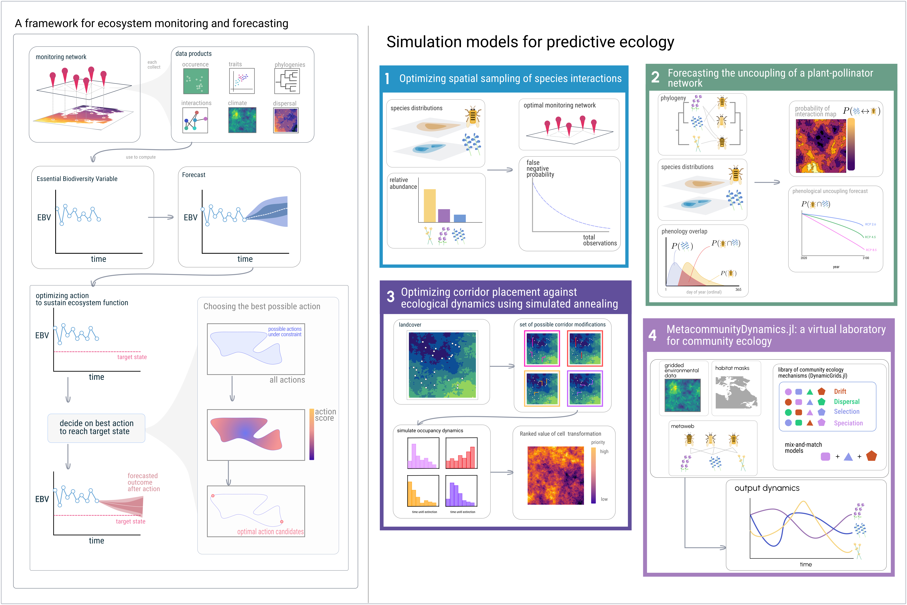

# Introduction

Within the last several hundred years, human activity has induced
rapid changes in Earth's atmosphere, oceans, and surface. Greenhouse
gas emissions have caused an increase the temperature of both Earth's
terrain and oceans, and both agricultural and urban development has
rapidly reshaped the Earth's land cover. These the bulk of this change
has occurred within the last several hundred years, a geological
instant, inducing a sudden shift in conditions to Earth's climate and
biosphere. As a result, predicting how ecosystems will change in the
future, _ecological forecasting_, and then using these forecasts to
make decisions to mitigate the negative consequences of this change on
ecosystems, their functioning, and the services they provide to humans
has emerged as an imperative for ecology and environmental science
[@Dietze2017PreEco]. However, robust prediction of ecological
processes is, to say the least, quite difficult [@Beckage2011LimPre;
@Petchey2015EcoFor]. This difficultly is compounded by a few factors,
the first being that sampling ecosystems is not easy. Ecological data
is often biased, noisey, and sparse in both space and time. The
current paucity of ecological data has resulted in much interest in
developing global systems for _ecosystem monitoring_
[@Makiola2020KeyQue], which would systematize the collection of
biodiversity data in manner that makes detecting and predicting change
more possible than at the moment [@Urban2021CodLif].

The second major challenge in ecological forecasting is that the
underlying dynamics of most ecological processes are unknown and
instead must be inferred from this (sparse) data. Much of the history
of quantitatively modeling ecosystems have been done in the language
of dynamical systems, describing how the value of an observable state
of the system, represented by a vector of numbers $[x_1, x_2, \dots,
x_n]^T = \vec{x}$ changes as over time, yielding models in the form of
differential equations in continuous-time settings--$\frac{dx}{dt} =
f(x)$-- or difference equations in discrete-time settings--$x_t =
f(x_{t-1})$--where $f:\mathbb{R}^n \to \mathbb{R}^n$ is an arbitrary
function describing how the system changes on a moment-to-moment basis
(e.g. in the context of communities, $f$ could be Lotka-Voltera,
Holling-Type-III or DeAngelis-Beddington functional response). The
initial success of these forms of models can be traced back to the
larger program of ontological reductionism, which became the default
approach to modeling in the sciences after its early success in
physics, which, by the time ecology was becoming a quantitative
science (sometime in the 20th century, depending on who you ask),
became the foundation for early quantitative models in ecology.

However, we run into many problems when aiming to apply this type of
model to empirical data in ecology. Ecosystems are perhaps the
quintessential example of system that cannot be understood by
iterative reduction of its components into constituent
parts---ecological phenomena are emergent are the product of different
mechanisms operating a different spatial, temporal, and organizational
scales [@Levin1992ProPat]. Further, the form of this functional
response in real systems is effectively unknown, and some forms are
inherently more "forecastable" than others [@Chen2019RevCom;
@Pennekamp2019IntPre; @Beckage2011LimPre]. Further this analytical
approach to modeling explicitly ignores known realities: ecological
dynamics not deterministic, many analytic models in ecology assume
long-run equilibrium. Finally, perhaps the biggest challenge in using
these models to describe ecological processes is ecosystems vary
across more variables than the tools of analytic models are suited
for. As the number of variables in an analytic model increases, so
does the ability of the scientist to discern clear relationships
between them given a fixed amount of data, the so-called "curse" of
dimensionality.

But these problems are not solely unique to ecology. The term
_ecological forecasting_ implicitly creates an analogy with weather
forecasting. Although it has become a trite joke to complain about the
weather forecast being wrong, over the least 50 years the field of
numerical weather prediction (NWP) has dramatically improved out
ability to predict weather across the board [@Bauer2015QuiRev]. The
success of NWP, and the Earth observations systems that support it
[@Hill2004ArcEar], should serve as a template for development of a
system for monitoring Earth's biodiversity. Much like ecology, NWP is
faced with high-dimensional systems that are governed by different
mechanisms at different scales. The success of NWP is that, rather
than, say, attempt to forecast the weather in Quebec by applying
Navier-Stokes to entire province, to instead use simulation models
which describe known mechanisms at different scales, and use the
availability to increasing computational power to directly simulate
many batches of dynamics which directly incorporate stochasticity and
uncertainty in parameter estimates via random number generation.

But forecasting is only half the story---if indeed "[ecologists] have
hitherto only interpreted the world in various ways; the point is to
change it", then once we have a forecast about how an ecosystem will
change in the future, what if this forecast predicts a critical
ecosystem service will deteriorate? We are still left with the
question, what do we in the time being to mitigate the potentially
negative consequences a forecast predicts? In this framing, mitigating
the consequences of anthropogenic change on ecosystems becomes an
optimization problem: given a forecast of the future state of the
system, and some "goal" state for the future, the problem is then to
optimize our intervention into the system to maximize the probability
the system approaches our "goal" state. This dissertation aims to this
framework for ecosystem monitoring and forecasting (@fig:thesis,
left), and each chapter address some aspect of this pipeline to data
from a monitoring network to forecasts to mitigation strategy
(@fig:thesis, right).

{#fig:thesis}

# Chapter One: Forecasting the spatial uncoupling of a plant-pollinator network

Interactions between plants and pollinators form networks of
interactions, which structure the "architecture of biodiversity"
[@Jordano2007]. The functioning and stability of ecosystems emerge
from these interactions, but antropogenic change threatens to unravel
and "rewire" these networks [@CaraDonna2017IntRew], threating the
persistence of these systems. Plant-pollinator networks face two
possible forms of rewiring in response to anthropogenic environmental
change: spatial and temporal.   Spatially, range shifts could cause
interacting species to no longer overlap in space, and shifts in
phenology could cause interacting species to no longer overlap in
time.

This chapter uses several years of data on bumblebee-flower phenology
and interactions across several field sites, each consisting of
several plots across an elevational gradient, combined with spatial
records of species occurrence via GBIF to forecast this uncoupling.
This addresses the EBV to forecast of EBV element of the flow from
data to mitigation in @fig:thesis (left).

## Data

The data for this chapter is derived from multiple souces and can be
split into four categories. (1) Field data from three different field
sites across Colorado, each with multiple plots across an elevational
gradient, for seven, seven, and three years resptively. This data was
collected by Paul CaraDonna and Jane Oglevie (from the Rocky Mountain
Biological Laboratory) and Julian Resasco (CU Boulder).  (2) GBIF
spatial occurrence records of each of these species across Colorado,
including a metaweb of interactions across all of Colroado taken from
GBIF. (3) Remotely sensed data consisting of current and forecasting
bioclimatic variables from CHELSA.  (4) Phylogeny derived from NCBI
GenBank barcodes for mitochondrial COI (bumblebees) and chloroplast
rbcL (flowers).

## Methods

As the data we have is spatially sparse and likely to contain many
interaction "false-negatives" [@Strydom2021RoaPre], we beign by
predicting a metaweb of interactions as they exist _in the present_.

In stages, (1) take data from multiple sites to predict a spatial
metaweb of _Bombus_-flower interactions across Colorado. (2) Predict
how these spatial distributions will change under CMIP6. and (3)
quantify the lack of overlap between species for which there is a
predicted

The process of going from data to forecast can be split into the
following parts

1) Building an interaction prediction model (or rather a set of
candidate models, relative abundance, phylo embedding relative
abundance + phylo embedding) a la [@Gravel2019BriElt,
@Strydom2021RoaPre]

Reconstructing latent features for each species based on simulating
trait evolution on a phylogeny [@Strydom2021FooWeb].

2) Make it spatial based on distributions.

3) Forecast distributions based on CMIP6

## Preliminary Results

1) we got a tree and SDMs

Transition to next chapter by discussing uncertainty in interaction
prediction across space.

# Chapter Two: Optimizing spatial sampling of species interactions

This chapter uses simulation models to investigate the relationship
between species relative abundance, sampling effort, and probability
of accurately detecting an interaction between species, and further
proposes a method for optimizing the spatial sampling locations to
maximize the probability of detecting an interaction between two
species given their distributions. This addresses the optimization of
monitoring network part of the  flow from data to mitigation in
@fig:thesis.

As explored in the previous chapter, there are false-negatives in
interation data. There is more than one way to observe a
false-negative when sampling interactions: (@fig:fnrtaxonomy). It
begins with a conceptual framework for understanding the difference in
false-negatives in occurrence, co-occurrence, and interactions.
Co-occurrence is not the same thing as interaction [@Blanchet2020CooNot],
but often is used as a proxy.

{#fig:fnrtaxonomy}

We use a log-normal distribution as a null model of the
relative-abundance distribution [@Hubbell2001UniNeu] to simulate
realized false-negative rate as a function of varying sampling effort.

This also goes on to includes testing some assumptions of the model
with empirical data @fig:posassoc, which we analytically show that our
neutral model, if anything, underestimates the probability of
false-negatives due to positive correlations in co-occurrence in two
sets of spatially replicated samples of interaction networks
[@Hadfield2014TalTwo; @Thompson2000ResSol]---further I'm planning to
add the field data from the previous chapter into this anlysis once
available.

{#fig:posassoc}

Finally this chapter proposes a simulated annealing method to
optimize the efficacy of interactoin detection given a set
of observation points where the dist from observation site decays.
optimize set of repeated sampling locations L for a pair of species
_known_ distributions $D_a, D_b$.

# Chapter Three: Optimizing corridor placement against ecological dynamics

Promoting landscape connectivity is important to mitigate the effects
of land-use change on Earth's biodiversity. However, the practical
realities of conservation mean that there is a limitation on how much
we can modify landscapes in order to do this. So what is the best
place to put a corridor given a constraint on how much surface-area
you can change in a landscape? This is the question this chapter seeks
to answer. Models for proposing corridor locations have been
developed, but are limited in that are not developed around promoting
some element of ecosystem function, but instead by trying to find the
path of least resistance given a resistance surface
[@Peterman2018ResRP].

This chapter proposes a general algorithm for choosing corridor
placement to optimize a measurement of ecosystem functioning derived
from simulations run on each proposed landscape modification.

{#fig:ch3}

## Methods

We propose various landscape modifications which alter the cover of a
landscape, represented as a raster. We then compute a new resistance
surface based on the proposed landscape modification, and based on the
values of resistance to dispersal between each location we simulate
spatially-explicit metapopulation dynamics model
[@Ovaskainen2002MetMod; @Hanski2000MetCap] to estimate a distribution
of time until extinction for each landscape modification.

- brief overview of simulated annealing describe how you build the
- proposal function optimize landscape optimization

# Chapter Four: MetacommunityDynamics.jl: a virtual laboratory for community ecology

This chapter consists of a collection of modules in the Julia language
for different aspects of community ecology, including most of the code
used for the preceding chapters. Indeed `MetacommunityDynamics.jl`
(MCD.jl) is the epicenter of this set of tools, but due to the nature
of the Julia language, MCD.jl is interoperable with serveral existing
packages within the `EcoJulia` organization, including several to
which I have contributed. A diagram showing the relation between these
packages is shown in @fig:software.

{#fig:software}

# Conclusion

# Appendix

# References
